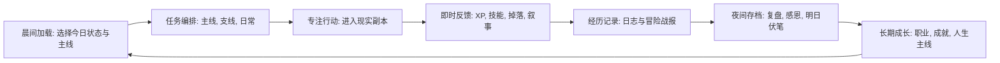

# Life RPG Evolution Plan

## 当前判断

本地项目我可以读取和分析；GitHub 远端通常也可以通过仓库配置或 `gh`/`git` 查询，但这次计划先以你的产品愿景和本地代码现状为准，不让既有实现绑架方向。

当前仓库已经不是空白项目，而是一个 Next.js 14 + Supabase 的 Life RPG 原型。现有能力分布在任务、技能、职业、商店、装备、收藏、数据、史诗/周常、日志、晨间加载、夜间存档、专注和冒险等页面中，例如 [`/Users/feijiezhao/Desktop/life-rpg/src/app/tasks/page.tsx`](/Users/feijiezhao/Desktop/life-rpg/src/app/tasks/page.tsx)、[`/Users/feijiezhao/Desktop/life-rpg/src/app/morning-load/page.tsx`](/Users/feijiezhao/Desktop/life-rpg/src/app/morning-load/page.tsx)、[`/Users/feijiezhao/Desktop/life-rpg/src/app/night-save/page.tsx`](/Users/feijiezhao/Desktop/life-rpg/src/app/night-save/page.tsx)、[`/Users/feijiezhao/Desktop/life-rpg/src/lib/execute-task-completion.ts`](/Users/feijiezhao/Desktop/life-rpg/src/lib/execute-task-completion.ts)。接下来的重点不是加更多功能，而是定义清楚“为什么存在、每天怎么玩、长期怎么成长、技术上怎么稳定承载”。

## 产品定义

第一步会沉淀一份产品北极星文档，明确 Life RPG 不是普通 Todo，也不是效率压榨工具，而是帮助用户重新获得生活掌控感、意义感和成长叙事的“现实世界角色扮演系统”。核心表达会围绕：

- 用户不是 NPC，也不是流水线螺丝钉，而是自己人生游戏的玩家。
- 现实世界不能读档、只有一条命，所以系统要帮助用户更沉浸地活在当下。
- 奖励机制要服务于觉察、行动、恢复和长期成长，而不是制造焦虑或任务债务。
- 每个人的经历、技能、关系、身体状态和心理状态都应该被记录成独特的世界故事。

然后把产品核心循环定义为：

## MVP 范围

网页 MVP 会优先保留并打磨最能证明产品价值的闭环：

- 新用户建立角色：身份、当前人生阶段、想成为怎样的人、当前困境、初始职业/属性。
- 今日游戏循环：晨间加载、今日主线、支线任务、专注执行、完成奖励、夜间存档。
- 成长系统：XP、技能、职业倾向、长期史诗任务、成就收藏。
- 生活记录：日记、每日摘要、关键经历、人生故事线。
- 反馈系统：即时奖励要有情绪价值，但不过度游戏化，不把未完成包装成惩罚。

暂时降低优先级的内容：复杂社交、排行榜、强竞技、重度装备经济、过早的穿戴设备接入。它们可以作为未来扩展，但不进入第一阶段产品验证核心。

## 技术实现方向

现有技术栈适合先做网页 MVP：[`/Users/feijiezhao/Desktop/life-rpg/package.json`](/Users/feijiezhao/Desktop/life-rpg/package.json) 显示项目已使用 Next.js、React、TypeScript、Tailwind、Supabase。下一步技术重点是整理“数据真相来源”和“跨端边界”。

当前存在一个需要优先处理的架构问题：`profiles`/`tasks` 等部分数据在 Supabase，`userProfile`、史诗任务、周常、部分游戏状态在 localStorage。为了后续网页多设备同步和微信小程序复用，计划逐步把核心状态迁移到 Supabase：角色档案、任务、技能进度、长期任务、每日日志、奖励记录、成就记录。localStorage 只保留草稿、离线缓存、UI 偏好或临时会话状态。

为微信小程序做准备时，不建议一开始共享 UI。更稳妥的方式是共享产品模型和后端 API：网页继续用 Next.js，未来小程序通过同一套 Supabase/服务接口访问角色、任务、日志、奖励和成就数据。可复用层重点放在 `src/lib` 的领域逻辑和 `src/types` 的数据模型，而不是页面组件。

## 执行顺序

第一阶段先做文档和收束：新增产品愿景、MVP 说明、核心循环、信息架构和技术路线文档，让项目有一个清晰的“设计宪法”。建议落在 `docs/product/vision.md`、`docs/product/mvp.md`、`docs/architecture/roadmap.md`。

第二阶段整理现有网页：对齐导航和核心路径，明确哪些页面属于 MVP 主循环，哪些是实验功能；修复明显体验断点，例如专注页、晨间页、夜间页和任务页之间的入口关系；统一面板样式和视觉语言。

第三阶段整理数据模型：以现有 [`/Users/feijiezhao/Desktop/life-rpg/supabase/schema.sql`](/Users/feijiezhao/Desktop/life-rpg/supabase/schema.sql)、[`/Users/feijiezhao/Desktop/life-rpg/src/types/db.ts`](/Users/feijiezhao/Desktop/life-rpg/src/types/db.ts)、[`/Users/feijiezhao/Desktop/life-rpg/src/types/quests.ts`](/Users/feijiezhao/Desktop/life-rpg/src/types/quests.ts) 为基础，设计角色档案、任务、技能、日志、奖励流水、成就、长期任务的稳定结构。

第四阶段再进入实现：先完成网页 MVP 的每日闭环，再逐步迁移 localStorage 状态到 Supabase，最后抽象可供微信小程序复用的 API 和领域模型。

## 需要注意的产品边界

这个产品涉及心理健康、意义感和生活掌控感，因此设计上要避免把用户推向自责、成瘾或过度量化。系统可以提供仪式感、反馈和记录，但不能假装替代心理治疗；可以鼓励用户行动，但要允许低能量日、恢复日、失败复盘和重新开始。